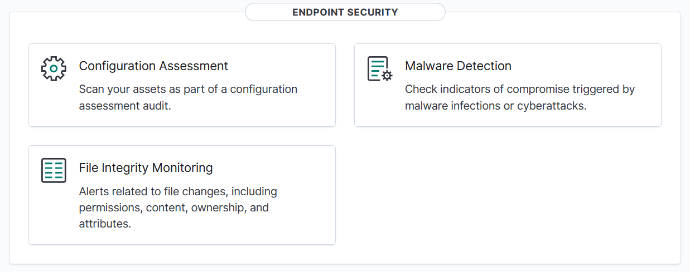
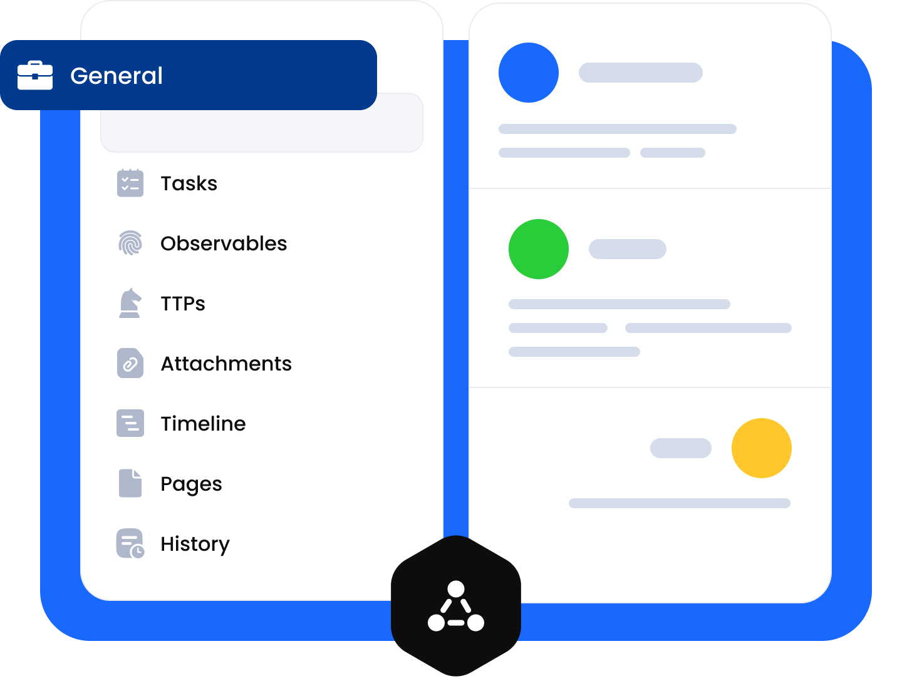
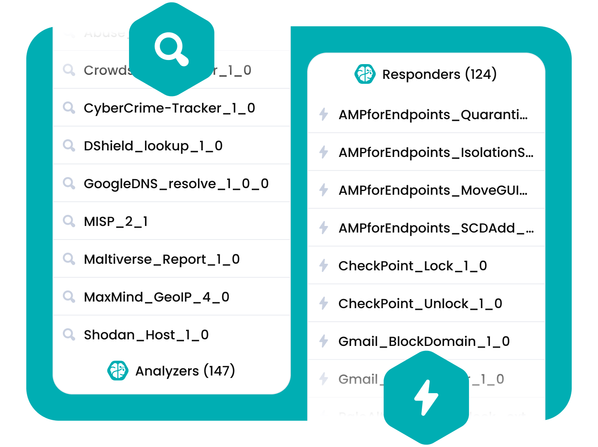
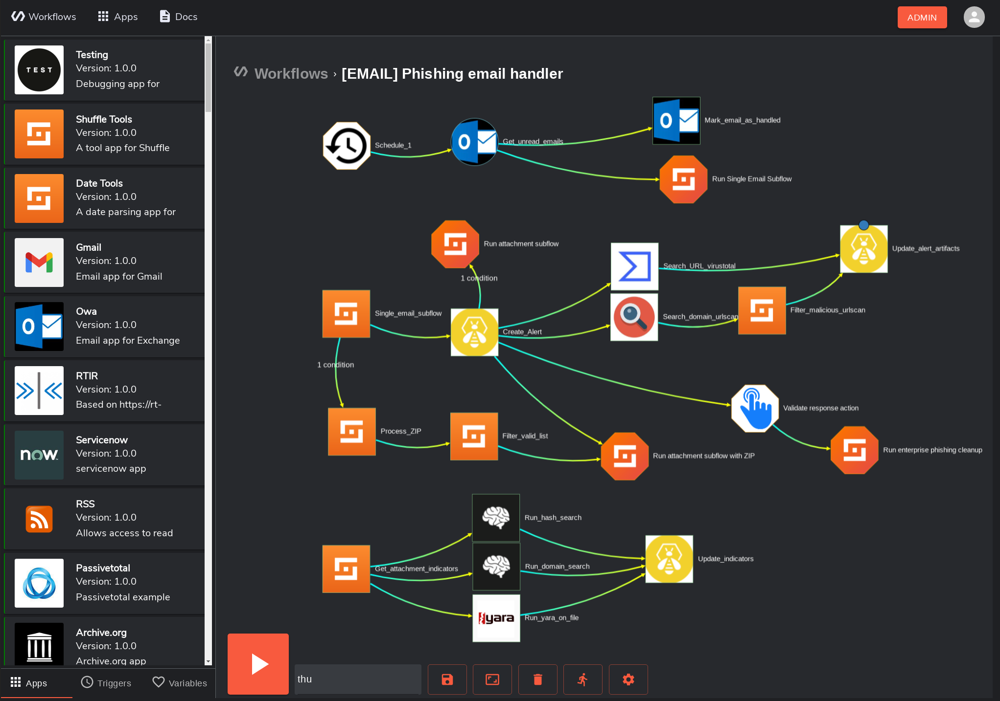
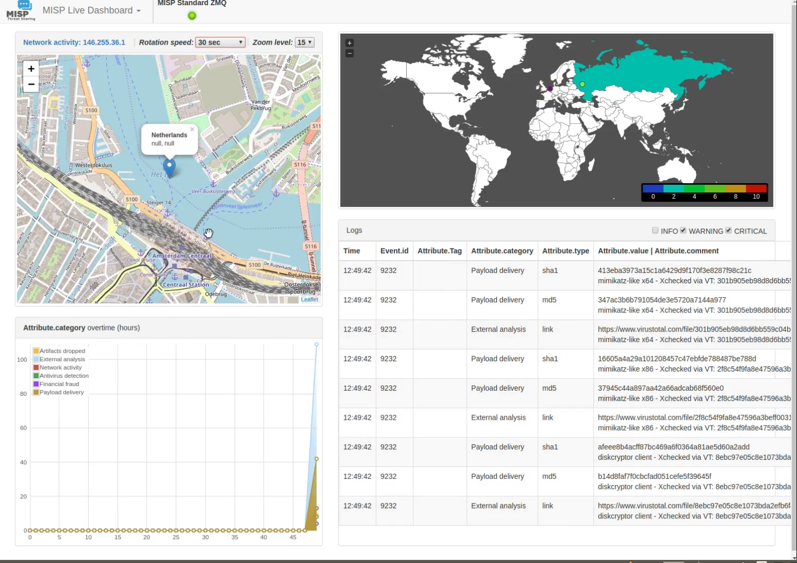
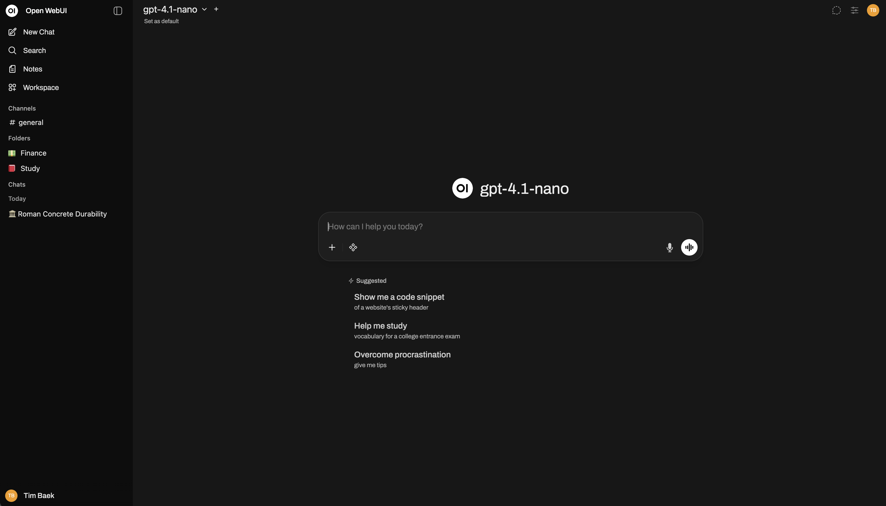

# 🧠 AI-Augmented SOC Lab

[](https://github.com/sandeepmothukuri/AI-Augmented-SOC-Lab/actions)
[](https://attack.mitre.org/)

A practical Security Operations Center laboratory for building, testing, and documenting blue-team workflows across security telemetry, detection, enrichment, SOAR, case management, and **AI-assisted analyst workflows**.

> **AI augments the analyst; it does not replace analyst judgment.**

---

## 🎯 Project Focus

This repository is the **SOC operations and laboratory layer** of the project portfolio.

It focuses on:

- Security telemetry and alert generation
- SIEM / endpoint security workflows
- Detection and triage
- Threat-intelligence enrichment
- SOAR orchestration
- Incident case management
- MITRE ATT&CK mapping
- Local LLM-assisted analysis
- Repeatable security test scenarios

The AI component is intentionally positioned as an **analyst-assistance capability**, while the separate `AI-SOC-Decision-Engine` project can serve as a dedicated AI decision/control-plane implementation.

---

## 📐 SOC Architecture

```text
 Security Telemetry
        │
        ├── Endpoint / Host Events
        ├── Security Logs
        └── Network Telemetry
                │
                ▼
        ┌───────────────┐
        │     Wazuh     │
        │ SIEM / EDR    │
        └───────┬───────┘
                │
                ▼
        Detection / Alert
                │
                ▼
        ┌───────────────┐
        │    Shuffle    │
        │     SOAR      │
        └───────┬───────┘
                │
        ┌───────┼────────┐
        ▼       ▼        ▼
      MISP   Cortex   AI Engine
       CTI   Analysis  Local LLM
        │       │        │
        └───────┼────────┘
                ▼
        Enriched Alert Context
                │
                ▼
        ┌───────────────┐
        │    TheHive    │
        │ Case Mgmt     │
        └───────┬───────┘
                │
                ▼
        SOC Analyst Review
                │
                ▼
        Investigation / IR
```

### Operational lifecycle

```text
Detect → Validate → Enrich → Triage → Investigate → Scope → Respond → Document → Improve
```

---

## 🧩 Technology Stack

| Component | Function | Repository Role |
|---|---|---|
| **Wazuh** | SIEM / endpoint security | Telemetry and detection |
| **Suricata** | Network IDS/IPS | Network detection capability |
| **Zeek** | Network monitoring | Network visibility capability |
| **Shuffle** | SOAR | Workflow orchestration |
| **MISP** | Threat intelligence | IOC / CTI enrichment |
| **Cortex** | Observable analysis | Enrichment capability |
| **TheHive** | Case management | Investigation tracking |
| **Ollama** | Local LLM inference | Private AI assistance |
| **LangChain** | AI orchestration | AI analysis pipeline |
| **FastAPI** | API framework | AI engine interface |

> Components are documented according to their intended laboratory role. Deployment status can vary by environment; screenshots are evidence of the referenced interfaces, not a claim of continuous production availability.

---

## 🤖 AI-Assisted SOC Workflow

The AI layer supports analysts with structured analysis rather than acting as an autonomous authority.

```text
Alert
  │
  ▼
Context Normalization
  │
  ▼
AI Analysis
  ├── Alert Summary
  ├── Severity Assessment
  ├── Confidence
  ├── MITRE ATT&CK Context
  ├── Investigation Guidance
  └── Response Recommendation
  │
  ▼
Analyst Validation
  │
  ├── Close
  ├── Investigate
  ├── Enrich
  └── Escalate
```

### AI use cases

- Alert summarization
- Analyst-assisted triage
- Severity assessment
- MITRE ATT&CK mapping
- Investigation guidance
- Response recommendations
- Playbook assistance
- Natural-language security queries

AI output should always be validated against the underlying security evidence before consequential response actions are taken.

---

## 📊 Detection & Investigation Model

| Stage | Objective |
|---|---|
| **Detect** | Identify suspicious or anomalous activity |
| **Validate** | Determine whether the alert represents meaningful activity |
| **Enrich** | Add IOC, threat-intelligence, and observable context |
| **Triage** | Establish priority, severity, and next actions |
| **Investigate** | Analyze evidence and determine scope |
| **Respond** | Execute appropriate containment or remediation |
| **Document** | Preserve investigation context and outcome |
| **Improve** | Feed lessons learned back into detection engineering |

---

## 🧪 Validation & Test Scenarios

The repository includes scripts and workflow definitions for exercising SOC scenarios without requiring real-world malicious activity.

```bash
# Pipeline health check
./scripts/test-pipeline.sh

# Test a specific synthetic scenario
python3 scripts/send-test-alert.py ssh-bruteforce

# Run the available scenario set
python3 scripts/send-test-alert.py all
```

These tests are intended for controlled laboratory validation.

---

## 📸 Visual Evidence

The following **10 repository images** are displayed directly below. GitHub supports repository-relative image paths in Markdown, which keeps the README portable when the repository is cloned. citeturn0search0

### 01 — Wazuh Security Operations Dashboard


### 02 — Wazuh Endpoint Security



### 03 — Wazuh Threat Intelligence


### 04 — TheHive Case Management



### 05 — TheHive Alert Management


### 06 — TheHive + Cortex Analysis



### 07 — Shuffle SOAR Workflow



### 08 — MISP Threat Intelligence Dashboard



### 09 — MISP Trending Indicators


### 10 — Ollama / Open WebUI



> **Evidence boundary:** these images document the interfaces represented in the project. They are not presented as proof that every platform is continuously deployed, externally reachable, or connected in every environment.

---

## 📁 Repository Structure

```text
AI-Augmented-SOC-Lab/
├── .github/
│   └── workflows/
├── ai-engine/
│   ├── app.py
│   ├── analyzer.py
│   ├── thehive_client.py
│   └── prompts/
├── docker/
│   ├── docker-compose.wazuh.yml
│   ├── docker-compose.thehive.yml
│   ├── docker-compose.shuffle.yml
│   ├── docker-compose.misp.yml
│   └── docker-compose.ollama.yml
├── shuffle-workflows/
├── wazuh-config/
├── thehive-config/
├── scripts/
├── docs/
│   ├── ai-prompts.md
│   ├── mitre-mapping.md
│   ├── setup-guide.md
│   └── screenshots/
├── SECURITY.md
├── CONTRIBUTING.md
└── README.md
```

---

## 🚀 Quick Start

### Requirements

- Linux or WSL2
- Docker + Docker Compose
- Python 3.11 recommended
- 16 GB RAM minimum
- 32 GB RAM recommended for a broader stack
- 100 GB+ available storage

### Clone

```bash
git clone https://github.com/sandeepmothukuri/AI-Augmented-SOC-Lab.git
cd AI-Augmented-SOC-Lab
```

### Deploy

```bash
chmod +x scripts/*.sh
./scripts/deploy.sh
```

### Configure local AI

```bash
./scripts/setup-ollama.sh
```

### Run the AI engine locally

```bash
cd ai-engine
pip install -r requirements.txt
python app.py
```

For the detailed environment setup, endpoint onboarding, workflow configuration, and troubleshooting procedure, see [`docs/setup-guide.md`](docs/setup-guide.md).

---

## 🔐 Security Principles

- Keep credentials and API keys outside committed source files.
- Do not commit production telemetry or customer data.
- Prefer local AI inference for sensitive laboratory data.
- Treat AI output as advisory.
- Validate security conclusions against source evidence.
- Use synthetic test data when demonstrating attack scenarios.
- Keep production environments separate from this laboratory.

---

## 🧭 Documentation

| Document | Purpose |
|---|---|
| [`docs/setup-guide.md`](docs/setup-guide.md) | Installation and environment setup |
| [`docs/ai-prompts.md`](docs/ai-prompts.md) | AI prompt and analysis guidance |
| [`docs/mitre-mapping.md`](docs/mitre-mapping.md) | ATT&CK mapping |
| [`SECURITY.md`](SECURITY.md) | Security reporting and project security guidance |
| [`CONTRIBUTING.md`](CONTRIBUTING.md) | Contribution guidance |

---

## 🧪 CI Validation

The repository includes GitHub Actions validation for Python formatting/linting, Docker Compose configuration, JSON configuration files, and Wazuh XML rules. fileciteturn105file0

This provides a baseline check that configuration and source artifacts remain structurally valid as the project evolves.

---

## 🗺️ Project Roadmap

### Detection Engineering

- Expand behavioral detections
- Increase MITRE ATT&CK coverage
- Add controlled validation scenarios
- Improve detection-to-investigation documentation

### SOC Automation

- Expand Shuffle workflows
- Improve enrichment paths
- Add robust failure handling
- Improve analyst approval points

### AI Assistance

- Structured model-output validation
- Evidence-aware prompts
- Confidence calibration
- Prompt-security controls
- Model evaluation datasets
- Analyst feedback loops

### Observability

- Pipeline health visibility
- Workflow execution evidence
- AI analysis metrics
- Detection validation results

---

## 🔬 Engineering Philosophy

> **Build it. Test it. Measure it. Document it. Improve it.**

This laboratory is intended to demonstrate practical security engineering: connecting telemetry to detections, detections to investigations, investigations to response, and lessons learned back into detection improvement.

---

## 📜 License

MIT License.

---

## 👤 Author

### Sandeep Mothukuri

**Senior SOC Analyst (L3) · Detection Engineering · Threat Hunting · Incident Response · Security Engineering**

Focus areas include Security Operations, Detection Engineering, Threat Hunting, Incident Response, SIEM/XDR, SOAR, DFIR, MITRE ATT&CK, Security Automation, and AI-Augmented SOC Operations.

---

⭐ If this laboratory is useful for your SOC engineering or blue-team research, consider starring the repository.